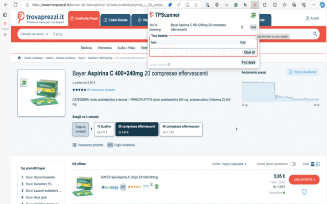

# TPscanner 

A cross-browser extension to find the best prices for items listed under [Trovaprezzi.it](https://www.trovaprezzi.it).

    

    
    
    

## Usage

1. Load the extension into your browser.
2. Navigate to [Trovaprezzi.it](https://www.trovaprezzi), search for one or more items.
3. Choose the desired quantity and add items to your basket,
3. The extension will find the best individual and cumulative price for the items selected.

## Contributions

Contributions are welcome! Please submit a pull request or create an issue to contribute to this project.

### Instructions

#### Building the extension

1. Open your terminal to the project directory.
2. Run the `make all` command to build the extension for Chrome, Firefox, and Safari. This will create each build in the `build/` directory.

Note:
* Safari build will start only on macOS, if XCode is installed.

### Manual installation

**Google Chrome**

1. Open Google Chrome and navigate to `chrome://extensions`.

2. Enable Developer mode by clicking the toggle switch next to "Developer mode".

3. Click "Load unpacked" and select the `build/chrome` directory in your project folder.

**Edge**

Same as above, the only difference is that you need to navigate to `edge://extensions`.

**Firefox** 

1. Open Firefox and navigate to about:debugging.

2. Click "This Firefox" and then "Load Temporary Add-on...".

3. Navigate to the `build/firefox` directory in your project folder and select it.

### Running the extension from terminal

Make sure your browser is not running before executing any of these commands.

* **Chrome**: `make run/chrome`
* **Edge**: `make run/edge`
* **Firefox**: `make run/firefox`

Note:
* Unlike Chrome, Edge does not run in development mode
* For Firefox, the script assumes you have "Firefox Developer Edition" installed. You can easily change the name to "Firefox" in the `make` script; it also requires `web-ext` to be installed. 

## Donations

## License

This project is licensed under the MIT license, see the [LICENSE](LICENSE) file.
